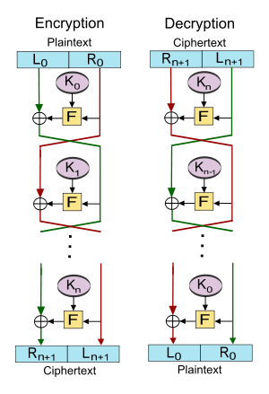
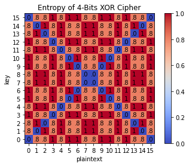

# Entropy
Entropy of encrypted data

**This project is WIP!**

##### *Disclaimer: Documentations in this project are partially written with the help of GPT.*

## Introduction
This is the final project for the course, "Math Methods for Physicists" in National Tsing Hua University. The goal of this project is to study the entropy of encrypted data. 

In followings, I will introduce some basics concepts used in this project.

---

Details about important properties in information theory

### Information

[Information](https://en.wikipedia.org/wiki/Information) is a measure of the uncertainty of an outcome. It is related to the amount of data that is required to specify the outcome of an event. The more uncertain an outcome is, the more information is required to resolve uncertainty of the outcome.

The information is calculated using the [Shannon information](https://en.wikipedia.org/wiki/Information_(measure)). Shannon information is defined as:

where $p(x_i)$ is the probability of the $i$-th symbol in the data.

### Entropy

Entropy is a fundamental concept in information theory that quantifies the uncertainty or randomness associated with a random variable. It measures the average amount of information required to describe or encode an event or a set of outcomes.

The entropy is calculated using the [Shannon entropy](https://en.wikipedia.org/wiki/Entropy_(information_theory)). Shannon entropy is defined as:

where $p(x_i)$ is the probability of the $i$-th symbol in the data.

### Mutual Information

[Mutual information](https://en.wikipedia.org/wiki/Mutual_information) is a fundamental concept in information theory and statistics that measures the amount of information that two random variables share. It provides a quantitative measure of the dependence or association between the variables, revealing how much knowing the value of one variable can reduce uncertainty about the other.

The mutual information is calculated using the [Kullback-Leibler divergence](https://en.wikipedia.org/wiki/Kullback%E2%80%93Leibler_divergence). Kullback-Leibler divergence is defined as:

where $p(x_i)$ is the probability of the $i$-th symbol in the data, and $q(x_i)$ is the probability of the $i$-th symbol in the encrypted data.

And the mutual information is defined as:

where $P(X,Y)$ is the joint probability of $X$ and $Y$, and $P(X)P(Y)$ is the product of the marginal probabilities of $X$ and $Y$.

### Conditional Entropy

[Conditional entropy](https://en.wikipedia.org/wiki/Conditional_entropy) is a measure of the amount of information needed to describe the outcome of a random variable $Y$ given that the value of another random variable $X$ is known. It is also known as the equivocation of $Y$ given $X$.

The conditional entropy is defined as:

where $p(x_i)$ is the probability of the $i$-th symbol in the data, and $p(y_j|x_i)$ is the probability of the $j$-th symbol in the encrypted data given the $i$-th symbol in the data.

### 1. Relation between Entropy, Mutual Information, and Conditional Entropy

There is a relation between entropy, mutual information, and conditional entropy:

$$
I(X;Y) = H(X) - H(X|Y) = H(Y) - H(Y|X)\tag{1}
$$

### 2. Encryption

There are three elements in encryption: plaintext, ciphertext, and key. Plaintext is the original message. Ciphertext is the encrypted message. Key is the secret used to encrypt the plaintext. The encryption process is a function that maps the plaintext and key to the ciphertext. The decryption process is a function that maps the ciphertext and key to the plaintext.

Firstly, we consider the single-bit encryption. To make sure that once we know the ciphertext and the key, we can recover the plaintext, the encryption function must be a bijection. The possible encryption functions are:

$$
f_1(0,0) = 0, f_1(0,1) = 1, f_1(1,0) = 1, f_1(1,1) = 0
$$

$$
f_2(0,0) = 1, f_2(0,1) = 0, f_2(1,0) = 0, f_2(1,1) = 1
$$

$f_1$ is XOR encryption, and $f_2$ is XNOR encryption. They both have the characteristic that ciphertext is corresponding to both 0, 1; only once we know the key is, the plane text can be recovered. And in most of cases, we pick XOR encryption as the most basic encryption to bit-wise operation.

Before we take account into multi-bits encryption, there are two important properties of the operation of a secure cipher identified by Shannon: [confusion and diffusion](https://en.wikipedia.org/wiki/Confusion_and_diffusion). Confusion means that the relationship between the ciphertext and the key must be complex and involved. Diffusion means that the statistical structure of the plaintext must be dissipated into long-range statistics of the ciphertext.

There are two common ways to achieve confusion and diffusion which are [Substitution-Permutation Network](https://en.wikipedia.org/wiki/Substitution%E2%80%93permutation_network) (SP-Network) and [Feistel Cipher](https://en.wikipedia.org/wiki/Feistel_cipher).

Details about SP-Network and Feistel Cipher

1. **SP-Network** contains two main features: substitution and permutation. Substitution means that the plaintext is replaced by the ciphertext using a substitution table. Permutation means that the order of the bits in the ciphertext is changed. Finally, at each round, the round key is combined using XOR encryption and sends the results to next round. The SP-Network is illustrated as follows:

A sketch of a SP-Network with 3 rounds. Cited from <a href="https://en.wikipedia.org/wiki/Substitution%E2%80%93permutation_network">wiki</a>.

2. **Feistel Cipher** use another way to realize confusion and diffusion. It splits the plaintext into two halves, and each round, the left half is XORed with the round key and then the result is sent to the round function. The output of the round function is XORed with the right half and then the result is sent to the next round. The Feistel Cipher is illustrated as follows:

A sketch of a Feistel Cipher. Cited from <a href="https://en.wikipedia.org/wiki/Feistel_cipher">wiki</a>.

Based on these concepts, we have many kinds of algorithm to encrypt the data. We have an introduction about the most common encryption algorithm which is written with the help of GPT: [ClickMe!](./encryption_algorithm/README.md)

We discuss above that the encryption is all about bit, or binary system. Now, if we have a basis set of the data, e.g.: $\lbrace 0, 1, 2, 3, 4, 5, 6, 7, 8, 9\rbrace$ or $\lbrace A, B, C, ..., Z\rbrace$, we still can use the index to map the basis set to the binary data, like Base64 encoding. For the N-bases system, we have 11 methods introduced by [Shannon in 1949](https://ieeexplore.ieee.org/document/6769090) to encrypt the data, 

including:

1. [Simple Substitution Cipher](https://en.wikipedia.org/wiki/Substitution_cipher#Simple)
2. [Transposition](https://en.wikipedia.org/wiki/Transposition_cipher)
3. [Vigenère cipher](https://en.wikipedia.org/wiki/Vigen%C3%A8re_cipher)
4. [N-grams Substitution Cipher](https://jeremykun.com/2012/02/03/cryptanalysis-with-n-grams/)
5. Single Mixed Alphabet Vigenère Cipher: A simple substitution followed by a Vigenère cipher.
6. [Hill Cipher](https://en.wikipedia.org/wiki/Hill_cipher)
7. [Playfair Cipher](https://en.wikipedia.org/wiki/Playfair_cipher)
8. Multiple Mixed Alphabet Substitution: In this cipher there are a set of d simple substitutions which are used in sequence.
9. [Autokey Cipher](https://en.wikipedia.org/wiki/Autokey_cipher) 
10. [Fractional Ciphers](https://crypto.interactive-maths.com/fractionating-ciphers.html)
11. Codes: In codes words (or sometimes syllables) are replaced by substitute letter groups. Sometimes a cipher of one kind or another is applied to the result.

To make it clear, we can construct a function mapping the plaintext with the key to ciphertext as shown in the following form:

$$
f: \lbrace m_0, m_1, m_2, ..., m_{N-1}\rbrace \times \lbrace m_0, m_1, m_2, ..., m_{N-1}\rbrace \rightarrow \lbrace m_0, m_1, m_2, ..., m_{N-1}\rbrace
$$

which $f$ needs to satisfy the following properties:
1. $f$ is a bijection.
2. Ciphertext must correspond to every element in the basis set. That without the key, we cannot recover the plaintext.

Given a 3-elements basis set $\lbrace A, B, C\rbrace$, we have $3!2! = 12$ possible encryption functions, one of them is:

| $f$     | $A$ | $B$ | $C$ |
| ------- | --- | --- | --- |
| **$A$** | $A$ | $B$ | $C$ |
| **$B$** | $B$ | $C$ | $A$ |
| **$C$** | $C$ | $A$ | $B$ |

And a general form of encryption function can be represented as:

$$
c_i = f(p_i, k_i) = a\cdot p_i + b\cdot k_i + c \mod N
$$

where $a, b, c$ are integers, $N$ is the number of elements in the basis set, $p_i$ is the plaintext, $k_i$ is the key, and $c_i$ is the ciphertext. And the decryption function is:

$$
p_i = f^{-1}(c_i, k_i) = a\cdot p_i + b\cdot k_i + c \mod N
$$

where we can see that $f = f^{1}$, in this case, $f$ is so-called symmetric encryption. 

To realized the perfect secrecy in this way, we need to have a [one-time pad](https://en.wikipedia.org/wiki/One-time_pad) (OTP), which has been proved mathematically that it can achieve perfect secrecy and quantum resistance. However, it still have restrictions in the practical application, such as pre-shared key, key length, and key distribution (P.S. [Quantum Key Distribution](https://en.wikipedia.org/wiki/Quantum_key_distribution) (QKD) may be helpful in OTP.)

Nowadays, what we usually use in daily communication is the asymmetric encryption (as known as Public-key cryptography), such like [RSA](https://en.wikipedia.org/wiki/RSA_(cryptosystem)), [Elliptic Curve Cryptography](https://en.wikipedia.org/wiki/Elliptic-curve_cryptography) (ECC) and so on. In this case, we have two keys, one is public key, and the other is private key. The public key is used to encrypt the data, and the private key is used to decrypt the data. The public key is usually published to the public, and the private key is only known by the owner. 

The encryption function and decryption function now will no longer be a linear function as symmetric one, but a nonlinear function. The encryption function is usually a trapdoor function, which is easy to compute in one direction, but hard to compute in the opposite direction without the private key. Therefore, we can use asymmetric encryption to exchange the symmetric key, and then use the symmetric encryption to encrypt the data.

However, it has been proved that RSA is not quantum resistant, which means that the quantum computer can break the RSA in polynomial time with [Shor's algorithm](https://en.wikipedia.org/wiki/Shor%27s_algorithm). And now, we have [Post-quantum cryptography](https://en.wikipedia.org/wiki/Post-quantum_cryptography) (PQC) to resist the attack from both classical and quantum computer.

## Methods

We constructed a 4-bits XOR cipher as an example to show how to calculate the entropy of the encrypted data, mutual information and conditional entropy to show the relation of plaintext, key and ciphertext. 

In addition, to show the fractal structure of XOR encryption, we also constructed 10-bits and 8-bits XOR cipher.

The details of the methods can be found in the [entropy_of_encrypted.ipynb](./entropy_of_encrypted.ipynb).

## Results

To start with the 4-bits cipher, the following figure shows the ciphertext as the result of XOR operation between plaintext and key. We can see that the ciphertext is equally distributed to every element in the basis set.

4-Bits Ciphertext Heat Map

And to calculate the properties in information theory later, we firstly made a bar plot of the entropy in 4-bits basis set to have more clear view. In the figure, we can see that when the numbers of 0 and 1 are equal, the entropy reaches the maximum. And the entropy is at the minimum when all the bits are 0 or 1.

4-Bits Entropy Bar Plot

The entropy of the ciphertext is showed in the following figure. It turns into a four-fold symmetry instead of a fractal structure.

4-Bits Entropy of Ciphertext Heat Map

Then the mutual information between C, P and C, K are shown in the followings. We can see that they are a quarter turn to each other.

4-Bits Mutual Information between C, P and C, K

With [Eqn. (1)](#eqn1), we can calculate the conditional entropy in the 4 kinds of relation. Let's see when the plaintext or key is known and how the conditional entropy that ciphertexts have. Based on the mutual information we get, there are cross-like pattern on it and have a quarter turn to each other.

Conditional Entropy of Ciphertext when Plaintext or Key is Known

And when the ciphertext is known, the conditional entropy of plaintext and key are shown in the followings. We can see that the conditional entropy of plaintext and key are the same, which means that the plaintext and key are independent to each other.

Conditional Entropy of Plaintext and Key when Ciphertext is Known

## References

* [C. E. Shannon, "Communication theory of secrecy systems," in *The Bell System Technical Journal*, vol. 28, no. 4, pp. 656-715, Oct. 1949, doi: 10.1002/j.1538-7305.1949.tb00928.x.](https://ieeexplore.ieee.org/document/6769090)
* [C. E. Shannon, "A mathematical theory of communication," in *The Bell System Technical Journal*, vol. 27, no. 3, pp. 379-423, July 1948, doi: 10.1002/j.1538-7305.1948.tb01338.x.](https://ieeexplore.ieee.org/document/6773024)

## License
This project is licensed under the MIT License - see the [LICENSE](LICENSE) file for details.
